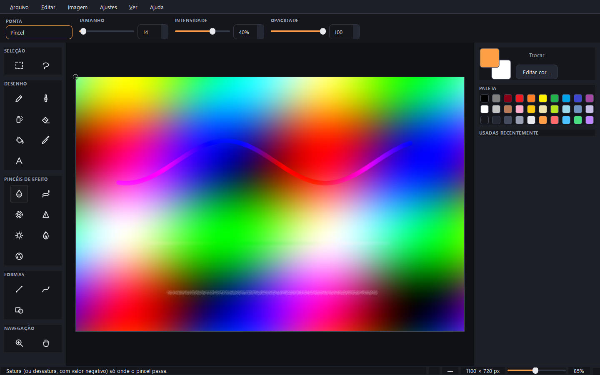
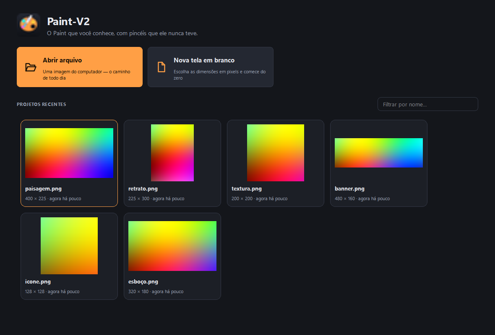

# Paint-V2

O Paint que você conhece, com os pincéis que ele nunca teve.

Editor de imagens desktop para Windows: tudo o que o Microsoft Paint faz, mais
uma família de **pincéis de efeito** — saturação, blend, desfoque, nitidez,
clarear, escurecer e matiz — e um **HUB** inicial com os projetos recentes em
miniatura.



---

## A ideia central: ponta × modo

No Paint, cada ferramenta é um bloco fechado. Aqui um pincel é a combinação de
duas coisas independentes:

- **Ponta** — a forma e a dinâmica do carimbo: Pincel, Lápis, Spray, Caligrafia 1
  e 2, Marcador, Óleo, Giz de cera, Lápis natural, Aquarela, Quadrado, Macio.
- **Modo** — o que acontece com os pixels sob o carimbo: pintar, apagar, saturar,
  blend, desfocar, dar nitidez, clarear, escurecer, girar o matiz.

Como os dois eixos são ortogonais, **qualquer efeito funciona com qualquer
ponta**. Dá para saturar com o Spray, borrar com a Caligrafia ou clarear com o
Giz de cera — combinações que não existem no original.

### Saturação localizada

O pincel de saturação vai de −100 (dessatura até o cinza) a +100 (triplica a
distância até o cinza). O botão direito inverte o sinal, então dá para saturar e
dessaturar sem tirar a mão do mouse.

Repassar o pincel no mesmo lugar **não** intensifica o efeito: o traço acumula
uma máscara e é aplicado sempre contra o estado do início da pincelada. Sem isso,
passar devagar saturaria mais do que passar rápido, e as sobreposições virariam
manchas.

### Blend

O blend arrasta a cor de onde o pincel esteve para onde ele está, dissolvendo
vincos, emendas e transições duras — o que o desfoque simples não resolve, porque
ele só borra no lugar em vez de misturar direções.

---

## O que mais tem

**Ferramentas clássicas** — lápis, pincel, spray, borracha, balde de tinta (com
tolerância, que o Paint não tem), conta-gotas, texto, linha, curva de Bézier em
três tempos e 14 formas geométricas.

**Seleção** — retangular e à mão livre, com mover, duplicar (Ctrl+arraste),
recortar, copiar, colar, inverter e recortar a imagem para a seleção. Pincéis,
balde e ajustes respeitam a seleção ativa.

**Ajustes de imagem** com prévia ao vivo: exposição, brilho, contraste, saturação,
vibração, matiz, temperatura, tonalidade, preto e branco, sépia, inverter e
posterizar — na imagem inteira ou só dentro da seleção.

**Imagem** — redimensionar, mudar o tamanho da tela, girar, espelhar.

**Suporte a caneta** — tabletes com pressão modulam tamanho e fluxo do traço.

**Transparência de verdade** — canal alfa preservado em PNG e WebP, com xadrez na
tela para você enxergar o que é transparente.

**HUB** — miniaturas dos projetos recentes, filtro por nome, abrir arquivo,
nova tela em branco com predefinições (Full HD, 4K, A4 a 300 dpi, Story…) e
arrastar-e-soltar de imagens.



---

## Instalação

Baixe o `Paint-V2-Setup-1.0.0.exe` mais recente em
[Releases](../../releases) e execute. A instalação é por usuário — não pede
permissão de administrador — e cria o atalho no Menu Iniciar, então basta
pesquisar por **Paint-V2** no Windows.

---

## Rodando a partir do código

Requer **Python 3.12+** e Windows 10/11.

```powershell
python -m venv .venv
& ".venv\Scripts\Activate.ps1"
pip install -r requirements.txt
python -m paintv2
```

Se o PowerShell recusar o script de ativação:

```powershell
Set-ExecutionPolicy -Scope Process -ExecutionPolicy Bypass
```

### Testes

```powershell
python -m pytest
```

A suíte cobre o núcleo de imagem (operações de cor, motor de pincel, histórico,
preenchimento, seleção, biblioteca de projetos) e também a interface — as
ferramentas são exercitadas por eventos de ponteiro reais, com o Qt em modo
`offscreen`.

### Gerando o executável e o instalador

```powershell
python scripts/build_app.py
```

Produz `dist/Paint-V2/Paint-V2.exe` e, se o [Inno Setup 6](https://jrsoftware.org/isinfo.php)
estiver instalado, também `dist/installer/Paint-V2-Setup-1.0.0.exe`.

```powershell
winget install -e --id JRSoftware.InnoSetup   # se ainda não tiver
```

---

## Atalhos

| Tecla | Ferramenta | | Tecla | Ferramenta |
|---|---|---|---|---|
| `B` | Pincel | | `M` | Seleção retangular |
| `P` | Lápis | | `N` | Seleção livre |
| `A` | Spray | | `L` | Linha |
| `E` | Borracha | | `C` | Curva |
| `F` | Balde de tinta | | `R` | Formas |
| `K` | Conta-gotas | | `T` | Texto |
| `S` | Saturação | | `U` | Desfoque |
| `G` | Blend | | `H` | Nitidez |
| `O` | Clarear | | `I` | Escurecer |
| `J` | Matiz | | `Z` | Lupa |

`X` troca as cores de frente e de fundo. `Ctrl` + roda dá zoom, `Espaço` ou o
botão do meio arrastam a imagem, `Ctrl+0` volta ao tamanho real e `Ctrl+9`
ajusta à janela. O **botão direito** pinta com a cor de fundo e inverte os
efeitos de saturação, matiz, clarear e escurecer.

---

## Arquitetura

```
src/paintv2/
├── core/          NumPy puro, sem Qt — testável sem abrir janela
│   ├── document        buffer RGBA compartilhado com o Qt, sem cópia
│   ├── color_ops       operações de cor vetorizadas
│   ├── brush_tips      pontas: a forma do carimbo
│   ├── brush_modes     modos: o efeito sob o carimbo
│   ├── stroke          motor de traço (espaçamento, máscara, snapshot)
│   ├── snapshot        cópia preguiçosa por ladrilhos
│   ├── history         desfazer/refazer por patch
│   ├── selection       máscara da seleção ativa
│   ├── fill            balde com tolerância
│   └── adjustments     pipeline de ajustes globais
├── tools/         traduz gestos do mouse em operações do núcleo
├── ui/            PySide6: canvas, HUB, janela do editor, painéis, diálogos
└── projects/      biblioteca de recentes exibida no HUB
```

Três decisões sustentam o desempenho:

1. **O `QImage` aponta para a memória do array NumPy.** Uma pincelada aparece na
   tela sem conversão nem cópia; basta invalidar o retângulo alterado.
2. **Tudo opera sobre a bounding box suja**, nunca sobre a imagem inteira.
3. **O histórico guarda patches**, não a imagem completa — desfazer um traço numa
   foto de 24 MP custa alguns KB, não 96 MB.

As decisões de projeto e o porquê de cada uma estão em
[`.claude/decisions.md`](.claude/decisions.md).

---

## Licença

MIT — veja [LICENSE](LICENSE).
